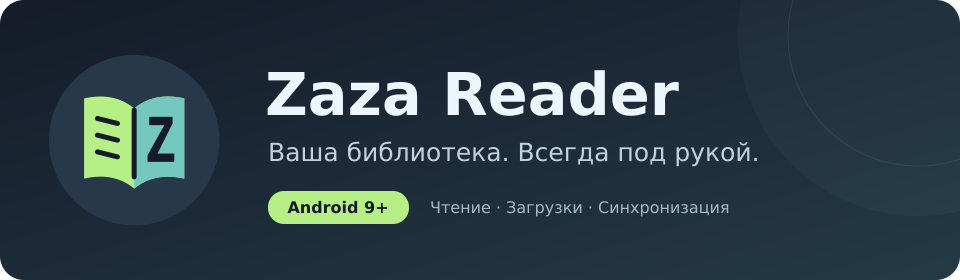
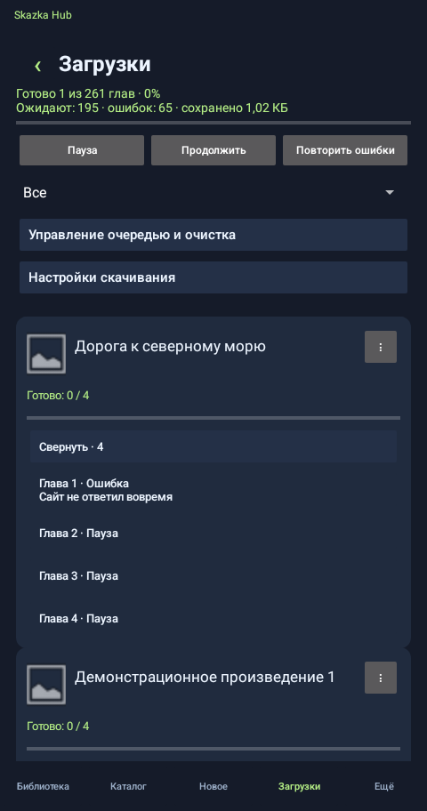
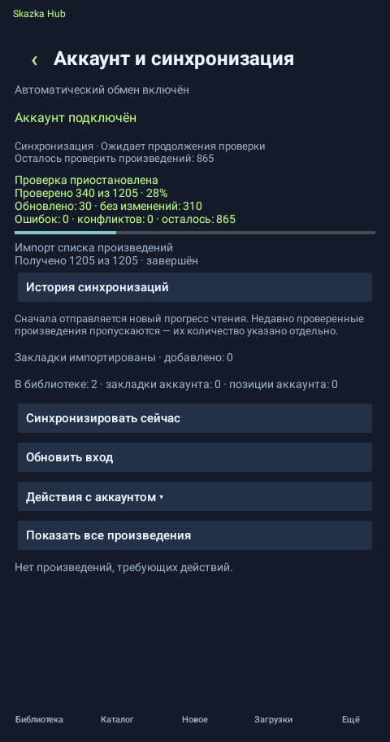
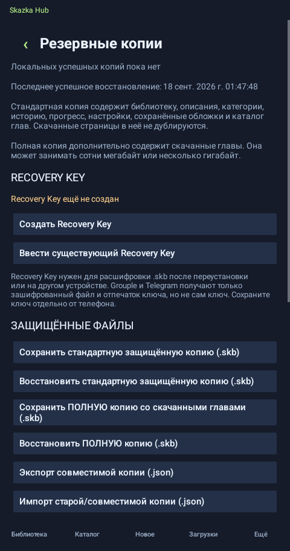
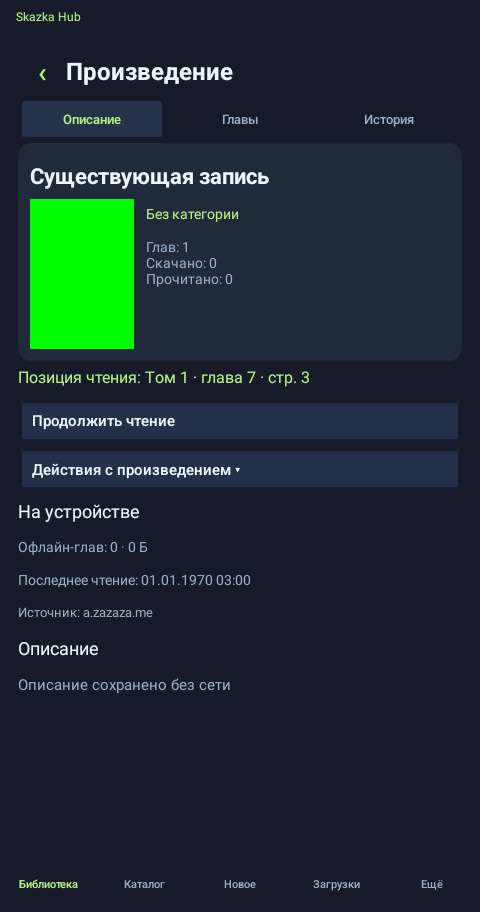

  

  
  
  

# Skazka Hub — releases / релизы

> **RU — основной язык · EN — обязательный второй язык**

## RU

**Skazka Hub 0.6.22-preview** — Android 13+ reader с local-first/offline-first библиотекой. Текущий публично поддерживаемый источник: **a.zazaza.me**.

### Проверенные экраны 0.6.22

Скриншоты получены HOSTKEY Android 13 device-gate на release-кандидате **0.6.22-preview**.

<table>
  <tr><th>Загрузки</th><th>Синхронизация</th></tr>
  <tr>
    <td></td>
    <td></td>
  </tr>
  <tr><th>Резервная копия</th><th>Offline recovery</th></tr>
  <tr>
    <td></td>
    <td></td>
  </tr>
</table>

### Главное в 0.6.22

- единая персистентная очередь Downloads для IMAGE + TEXT и общий state machine автозагрузок;
- SQLite LocalState как локальный source of truth и Library v2 с unread/new, коллекциями, фильтрами, list/grid, bulk actions и undo;
- native IMAGE, TEXT и MIXED reading flows, сохранение прогресса и продолжение следующей главы;
- зашифрованные резервные копии, полный архив скачанного контента и clean-install offline recovery;
- проверенные RU/EN интерфейсы и LOC-05 для модерируемых удалённых исправлений переводов;
- усиленная telemetry queue: race-safe flush и coalescing только повторяющейся low-priority usage-телеметрии;
- Vercel исключён из активных маршрутов и сохранён только как выключенный cold reserve;
- приватный source-repo уже переименован в `kroxaboom-sudo/skazka-hub`.

### Установка и обновление

Скачайте APK из **Releases → Latest** и устанавливайте новую версию поверх существующей. Удалять приложение перед обновлением не нужно.

`applicationId me.zaza.reader` пока сохраняется специально: это позволяет 0.6.22 установить поверх 0.6.21 без потери библиотеки, прогресса, истории и настроек. Полная package migration выполняется отдельно только после проверенного переноса данных.

Минимальная версия: **Android 13 / API 33**.
### Offline-first и обновления

Библиотека, SQLite LocalState, история, прогресс, сохранённые описания/обложки и уже скачанный контент остаются доступны без постоянного соединения с сервером. Remote Runtime Pack принимается только при корректной подписи; при недоступности подписанного обновления приложение использует встроенную/последнюю доверенную конфигурацию вместо ослабления проверки.

Встроенный updater 0.6.22 сначала проверяет будущий `skazka-hub-releases`, затем безопасно откатывается на `zaza-reader-releases`. Публичный release-repo пока сохраняет legacy-имя специально для старых установок; его переименование выполняется только после подтверждённого переходного релиза.

### Проверка релиза

HOSTKEY release process проверяет unit-тесты, Android 13 device-gate, install-over, SHA-256 APK, package/version/minSdk и сертификат подписи. Опубликованный APK одной версии считается неизменяемым артефактом.

---

## EN

**Skazka Hub 0.6.22-preview** is an Android 13+ reader built around a local-first/offline-first library. The currently supported public source is **a.zazaza.me**.

### Verified 0.6.22 screens

The four screenshots above were captured by the HOSTKEY Android 13 device gate from the **0.6.22-preview** release candidate.

### Highlights in 0.6.22

- one persistent Downloads queue for IMAGE + TEXT plus a shared automatic-download state machine;
- SQLite LocalState as the local source of truth and Library v2 with unread/new, collections, advanced filters, list/grid, bulk actions and undo;
- native IMAGE, TEXT and MIXED reading flows with persisted progress and next-chapter continuation;
- encrypted backups, full downloaded-content archives and clean-install offline recovery;
- verified RU/EN UI coverage plus LOC-05 for moderated remote translation corrections;
- a race-safe telemetry queue with coalescing limited to repetitive low-priority usage events;
- Vercel removed from active routes and retained only as a disabled cold reserve;
- the private source repository migrated to `kroxaboom-sudo/skazka-hub`.

### Install and update

Download the APK from **Releases → Latest** and install it over the existing app. Do not uninstall first.

The legacy `applicationId me.zaza.reader` is intentionally preserved for now so 0.6.22 can install over 0.6.21 without losing library data, reading progress, history or settings. A full package migration is a separate data-migration step.

Minimum version: **Android 13 / API 33**.

### Offline-first and update safety

Library data, SQLite LocalState, history, progress, saved metadata/artwork and downloaded content remain available without continuous server access. Remote Runtime Packs are accepted only with a valid signature; if a signed update is unavailable, the app keeps its embedded/last trusted configuration rather than weakening verification.

The 0.6.22 updater tries the future `skazka-hub-releases` feed first and safely falls back to `zaza-reader-releases`. The public release repository intentionally keeps its legacy name until older installations have crossed the transition release.

### Release verification

The HOSTKEY release process verifies unit tests, Android 13 device gates, install-over behavior, APK SHA-256, package/version/minSdk and the signing certificate. A published APK for a version is treated as immutable.

---

This public repository contains APK files, update metadata, release notes and verified screenshots. Android source is maintained separately in the private `kroxaboom-sudo/skazka-hub` repository. Signing keys are never published.
