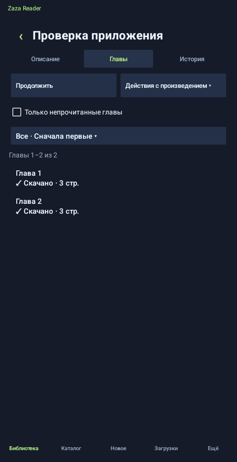
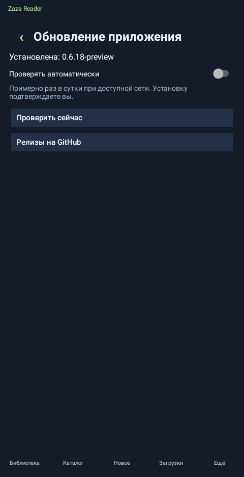

  

  
  
  

  <strong>Читайте мангу на Android, сохраняйте главы и продолжайте с нужной страницы.</strong>

  <a href="https://github.com/kroxaboom-sudo/zaza-reader-releases/releases/latest"><strong>↓ Скачать приложение</strong></a>
  &nbsp; · &nbsp;
  <a href="https://github.com/kroxaboom-sudo/zaza-reader-releases/releases">Все версии и изменения</a>
  &nbsp; · &nbsp;
  <a href="#установка">Как установить</a>

---

**Zaza Reader** — приложение для чтения с [a.zazaza.me](https://a.zazaza.me/). Библиотека, скачанные главы и локальный прогресс хранятся на телефоне. После подключения аккаунта приложение импортирует закладки и обменивается позицией чтения с сайтом.

**Android 9 и новее · Интерфейс на русском · Тестовые версии Preview**

## Как выглядит приложение

Снимки версии **0.6.18-preview** на Android 13 с демонстрационным произведением.

<table>
  <tr><th>Главы произведения</th><th>Обновление приложения</th></tr>
  <tr>
    <td></td>
    <td></td>
  </tr>
</table>

Нажмите на снимок, чтобы открыть его в полном размере.

## Всё для чтения

| Библиотека и чтение | Загрузки и синхронизация |
| --- | --- |
| Обложки, поиск, категории и сортировка | Скачивание отдельных глав и диапазонов |
| Настройка размера обложек | Выбор папки и хранение глав в CBZ |
| Чтение скачанных глав без интернета | Папки произведений в выбранном хранилище |
| Вертикальная лента и постраничное чтение | Загрузка только по Wi-Fi или через мобильную сеть |
| Масштабирование, полоса прокрутки и точная позиция | Импорт закладок после входа в аккаунт |
| Описание и сведения о произведении | Фоновый обмен с понятным статусом и обработкой конфликтов |

Дополнительно: резервные копии библиотеки и прогресса, расписание копирования, автоудаление прочитанных глав и обновление из приложения.

## Установка

1. Откройте **[последний релиз](https://github.com/kroxaboom-sudo/zaza-reader-releases/releases/latest)**.
2. В разделе **Assets** скачайте файл `ZazaReader-….apk` — он один для всех поддерживаемых версий Android.
3. Откройте APK и подтвердите установку. Если Android запросит разрешение на установку из этого источника, выдайте его приложению, из которого открыли файл.
4. Найдите произведение в каталоге или подключите аккаунт сайта для импорта закладок.

Для обновления установите новую версию **поверх существующей**: удалять приложение не нужно.

## Обновления без поиска APK

**Ещё → Настройки → Обновление приложения → Проверить сейчас**

Приложение умеет автоматически проверять обновления примерно раз в сутки при доступной сети. Перед установкой проверяются контрольная сумма и подпись APK; установку подтверждаете вы.

## Важно знать

<strong>Что работает без интернета?</strong>

Библиотека, сохранённые описания, обложки, список глав, история, прогресс и чтение уже скачанных глав. Эти данные открываются без ожидания сайта. Для поиска новых произведений, обновления списка глав и обмена закладками нужен доступ к сайту. Фоновую работу Android может откладывать для экономии заряда.

<strong>Что входит в резервную копию?</strong>

Библиотека, описания, сохранённые обложки, каталог глав, история, прогресс с позицией внутри страницы и поддерживаемые настройки. Скачанные страницы, данные входа и разрешения на папки не входят: главы нужно скачать, в аккаунт войти и папки выбрать снова. Старые копии читаются; при повторном восстановлении существующие записи сохраняются.

Можно сохранить файл на устройство или через установленное облачное приложение. Копирование по расписанию доступно, если выбранный файловый провайдер даёт постоянный доступ к папке. После записи приложение повторно читает и проверяет файл. В настройках показаны даты последней успешной копии и восстановления; неудачная попытка не заменяет дату успеха. Лимит копии — 32 МБ.

**Облачная папка и синхронизация устройств — разные функции.** Файл в облаке можно восстановить на другом устройстве вручную. Автоматическое объединение библиотек между устройствами не реализовано. Обмен закладкой с сайтом работает отдельно.

<strong>Какие главы удаляются автоматически?</strong>

Функция включается в настройках. По логике закладок сайта предыдущие главы считаются прочитанными. Приложение сохраняет текущую и последнюю полностью прочитанную главу; история и закладка остаются.

<strong>Почему в релизе два файла обновлений?</strong>

APK один. Файлы `update.json` и `update-android9.json` нужны разным поколениям встроенного обновлятора. Скачивать их вручную для установки приложения не требуется. Архивы **Source code**, которые показывает GitHub, также не нужны для установки.

## Развитие проекта

Приложение активно развивается. **Preview** в названии означает тестовую сборку. Проверки проводятся на эмуляторах Android 9 и 13; это не гарантирует одинаковую работу на всех устройствах. Актуальный номер опубликованной версии показан на значке **Latest** в начале страницы.

Дальше — проверки других версий Android, расширение сведений о произведениях, импорт CBZ и более удобное управление занимаемым местом.

---

Этот репозиторий содержит публичные сборки и файлы обновлений. Исходники хранятся отдельно в приватном репозитории. Ключ подписи не публикуется.

### Новые главы

Вкладка **Новое** показывает главы, обнаруженные после первой проверки произведения. Проверка выполняется примерно раз в 6 часов или вручную. В **Настройках → Скачивание** можно включить автоскачивание новинок для произведений, у которых на телефоне уже есть скачанные главы. Настройка изначально выключена и учитывает выбранную сеть и способ хранения. Android может откладывать фоновую работу.

## Режимы чтения

В **Ещё → Настройки → Чтение** можно включить постраничный режим, предзагрузку скачанных изображений и запоминание масштаба произведения. В постраничном режиме горизонтальный взмах при исходном масштабе переключает страницу; длинные страницы прокручиваются вертикально.

## Состояние синхронизации

Краткий статус в библиотеке показывает, выполняется ли обмен, ожидается ли сеть или требуется действие. Нажмите на него для подробностей и повторной проверки. При конфликте можно сравнить том, главу и страницу телефона и сайта и выбрать нужную позицию.

## Следующая глава

После конца главы продолжите прокрутку или перелистывание — откроется следующая глава. Если она не скачана, приложение загрузит её при разрешённой сети. Автопереход можно выключить в настройках чтения.

## Непрочитанные главы

Откройте произведение → **Главы** и включите **Только непрочитанные главы**. Выбор сохраняется после перезапуска. В меню **Действия с произведением** выберите **Скачать все непрочитанные**: команда работает со всем сохранённым списком, включая главы за пределами текущей страницы. Для получения ещё не известных приложению глав сначала обновите список.

Главы до закладки считаются прочитанными; текущая остаётся непрочитанной до завершения. Скачанные главы и активная очередь пропускаются, приостановленные и неудачные загрузки можно повторить. Для одной главы выбирается один перевод, предпочтительно совпадающий с текущей позицией. Ограничение сети применяется общей очередью загрузок.
