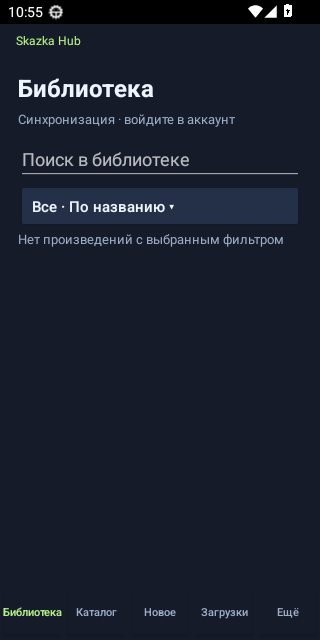
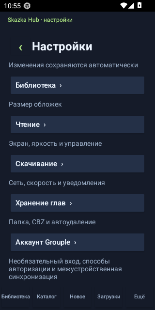

  

  
  
  

# Skazka Hub — releases / релизы

> **RU — основной язык · EN — обязательный второй язык**

## RU

**Skazka Hub** — Android-приложение для чтения с local-first/offline-first библиотекой. Текущий публично поддерживаемый источник — **a.zazaza.me**; дополнительные источники и зеркала допускаются через проверяемый Grouple Registry.

### Текущий публичный выпуск

- **Skazka Hub v0.6.21-preview** (`versionCode 27`).
- Минимальная версия: **Android 13 / API 33**.
- Публичное имя уже Skazka Hub, а legacy `applicationId`/package сохранён для установки поверх предыдущих версий без удаления приложения и потери данных.
- APK 0.6.21 считается неизменяемым опубликованным артефактом. Следующая ветка разработки — **0.6.22-preview / versionCode 28**.
- Исторические APK Zaza Reader остаются частью совместимого upgrade history.

Скачать актуальный публичный APK: **Releases → Latest**. Обновление устанавливается поверх существующей версии.

### Проверенные скриншоты / Verified screenshots

Снимки версии **0.6.21-preview**, полученные серверным release-gate на Android 13 после проверки обновления поверх предыдущей версии.

<table>
  <tr><th>Библиотека / Library</th><th>Настройки / Settings</th></tr>
  <tr>
    <td></td>
    <td></td>
  </tr>
</table>

### Архитектура проекта

- **Local-first / offline-first:** библиотека, SQLite LocalState, прогресс, история, настройки и скачанный контент не требуют постоянной доступности сервера.
- **SERVER-FIRST:** собственный HOSTKEY — основная площадка для backend, Android device-gates, release-gate, health-check, Telegram и эксплуатационных задач.
- GitHub используется для исходников/истории/тегов и публичных Releases, но не является обязательным runtime/build-узлом.
- **APP / CFG / REG / SRV / OPS** версионируются независимо.
- Direct — основной сетевой маршрут; VPN/Proxy — резерв и диагностика. Cloudflare — активный внешний fallback.
- **Vercel сохранён только как disabled cold reserve** и не участвует в обычном API/discovery/Telegram-трафике.
- Основные функции не должны требовать платной серверной инфраструктуры.

### Уже завершено в текущем `main`

После опубликованной 0.6.21 ветка разработки уже включает:

- единую Downloads/queue систему для **IMAGE + TEXT**;
- automatic downloads IMAGE/TEXT через общий state machine;
- **SQLite LocalState + Library v2**;
- native TEXT Reader;
- native **MIXED v1**;
- Android telemetry queue hardening/coalescing;
- неинтерактивный HOSTKEY Android 13 device gate;
- updater migration: будущий `skazka-hub-releases` проверяется первым, текущий legacy feed используется как fallback;
- development version **0.6.22-preview / 28**, проверенную install-over `0.6.21/27 → 0.6.22/28` с сохранением данных.

Эти пункты не считаются частью публичной 0.6.21, пока не будет выпущена следующая APK.

### Что осталось перед следующим релизом

1. восстановить **существующий** `runtime-v1` signing key и возобновить signed Runtime Pack без активного Vercel; до этого stale remote pack не раздаётся, приложение использует embedded/previous-good fallback;
2. завершить полный SERVER-FIRST/release/security/«всё своё» audit 0.6.22;
3. выпустить и проверить 0.6.22 поверх публичной 0.6.21;
4. только после публикации нового updater выполнить compatibility gate для переименования этого release-repo;
5. полную миграцию Android package/application ID выполнять отдельно и только с доказанным переносом пользовательских данных.

### Репозитории

- Android source: приватный **`kroxaboom-sudo/skazka-hub`**.
- Этот публичный репозиторий хранит APK, update metadata и release notes.
- Имя **`zaza-reader-releases`** пока сохраняется **только как legacy bootstrap compatibility endpoint**: 0.6.20 не доверяет redirect на новое repo-name, а опубликованная 0.6.21 ещё начинает проверку с legacy feed.
- Будущее canonical имя — `skazka-hub-releases`; переименование допустимо после публикации updater-моста и повторной проверки redirect/asset chain.
- APK signing keys никогда не публикуются.

---

## EN

**Skazka Hub** is an Android reader built around a local-first/offline-first library. The currently supported public source is **a.zazaza.me**; additional sources and mirrors are accepted only through the verified Grouple Registry flow.

### Current public release

- **Skazka Hub v0.6.21-preview** (`versionCode 27`).
- Minimum Android version: **Android 13 / API 33**.
- The public brand is Skazka Hub while the legacy Android application/package ID is intentionally retained for seamless upgrades and user-data continuity.
- The published 0.6.21 APK is immutable. Current development line: **0.6.22-preview / versionCode 28**.
- Historical Zaza Reader APKs remain part of the compatible upgrade history.

Use **Releases → Latest** for the current public APK and install updates over the existing app.

### Project architecture

- **Local-first / offline-first:** library data, SQLite LocalState, progress, history, settings and downloaded content remain usable without continuous connectivity.
- **SERVER-FIRST:** HOSTKEY is the primary environment for backend services, Android device gates, release gates, health checks, Telegram integrations and operations.
- GitHub is used for source/history/tags/public Releases, not as a mandatory runtime/build dependency.
- Independent version tracks: **APP / CFG / REG / SRV / OPS**.
- Direct access is primary; VPN/Proxy provides resilience and diagnostics. Cloudflare is the active external fallback.
- **Vercel is retained only as a disabled cold reserve** and is not part of normal API/discovery/Telegram traffic.
- Core functionality must not require paid server infrastructure.

### Already completed in current `main`

Development after public 0.6.21 already includes unified **IMAGE + TEXT** Downloads, automatic download state machine, **SQLite LocalState + Library v2**, native TEXT Reader, native **MIXED v1**, telemetry queue hardening, non-interactive HOSTKEY Android 13 verification, and the release-repository migration bridge. Development version **0.6.22-preview / 28** has passed an Android 13 install-over test from `0.6.21/27` while preserving app data.

These capabilities are not claimed as part of public 0.6.21 until the next APK is released.

### Before the next release

The existing `runtime-v1` signing key must be recovered so the current Runtime Pack can be signed without active Vercel; then 0.6.22 must pass the full SERVER-FIRST/release/security/own-code audit and upgrade verification. Release-repository migration happens only after the updater bridge is public and the redirect/asset chain has been re-tested.

### Repository roles

- Private Android source: **`kroxaboom-sudo/skazka-hub`**.
- This public repository stores APKs, update metadata and release notes.
- The name **`zaza-reader-releases`** is temporarily retained only as a legacy bootstrap compatibility endpoint. Planned canonical name: `skazka-hub-releases`, after the compatibility gate.
- APK signing keys are never published.
